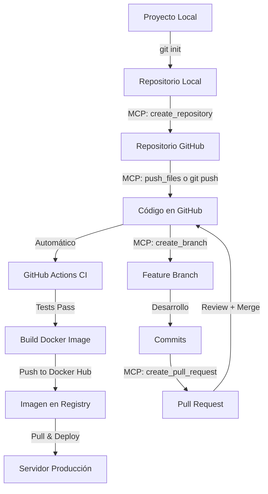

# Deployment usando MCP (Model Context Protocol)

Esta guía explica cómo desplegar el proyecto Zititex API usando las herramientas MCP de GitHub.

## 🎯 ¿Qué es MCP?

**MCP (Model Context Protocol)** es un protocolo que permite a los asistentes de IA interactuar directamente con servicios externos como GitHub, permitiendo:

- ✅ Crear repositorios
- ✅ Hacer push de archivos
- ✅ Crear branches
- ✅ Gestionar pull requests
- ✅ Configurar issues y más

---

## 📋 Prerequisitos

Antes de comenzar, necesitas:

1. ✅ Cuenta de GitHub
2. ✅ Token de acceso personal de GitHub (PAT)
3. ✅ Proyecto local listo (este proyecto)

---

## 🔧 Paso 1: Preparar el Entorno Local

### Inicializar Git Localmente

```bash
cd /Users/ctellez/developer/back/zititex-api/zititex-api

# Inicializar repositorio Git
git init

# Agregar todos los archivos
git add .

# Crear commit inicial
git commit -m "feat: initial project setup with Clean Architecture

- Implement Clean Architecture (domain, application, infrastructure, presentation)
- Configure FastAPI with Python 3.12
- Set up PostgreSQL and Redis integration
- Add comprehensive test suite with pytest (>99% coverage)
- Configure pre-commit hooks (black, isort, flake8, mypy)
- Create GitHub Actions workflows (CI, CD, PR checks)
- Add Docker and Docker Compose configuration
- Create comprehensive documentation
- Implement SOLID principles
- Configure type hints throughout codebase"

# Renombrar branch a main
git branch -M main
```

---

## 🚀 Paso 2: Crear Repositorio en GitHub usando MCP

### Opción A: Usar MCP Tool (Asistente)

El asistente puede crear el repositorio directamente:

```
Por favor, crea un repositorio en GitHub llamado "zititex-api" 
que sea público con la descripción "Zititex API - Clean Architecture REST API"
```

### Opción B: Comando Manual

O puedes usar el comando directo del tool:

```javascript
// El asistente ejecutará:
mcp_github_create_repository({
  name: "zititex-api",
  description: "Zititex API - Clean Architecture REST API with FastAPI",
  private: false,
  autoInit: false
})
```

---

## 📤 Paso 3: Push de Archivos usando MCP

### Opción A: Push Completo con MCP

El asistente puede hacer push de todos los archivos:

```
Por favor, haz push de todos los archivos del proyecto al repositorio 
zititex-api en la branch main
```

### Opción B: Git Tradicional

```bash
# Agregar remote
git remote add origin https://github.com/TU_USUARIO/zititex-api.git

# Push inicial
git push -u origin main
```

### Opción C: Usar mcp_github_push_files

```javascript
// El asistente puede ejecutar:
mcp_github_push_files({
  owner: "TU_USUARIO",
  repo: "zititex-api",
  branch: "main",
  files: [
    { path: "README.md", content: "..." },
    { path: "src/main.py", content: "..." },
    // ... todos los archivos
  ],
  message: "feat: initial project setup"
})
```

---

## ⚙️ Paso 4: Configurar Secrets de GitHub

Los secrets son necesarios para que GitHub Actions funcione correctamente.

### Secrets Requeridos

1. **DOCKER_USERNAME** - Tu usuario de Docker Hub
2. **DOCKER_PASSWORD** - Tu token de Docker Hub
3. **CODECOV_TOKEN** - Token de Codecov (opcional)

### Configurar via Web

1. Ve a tu repositorio en GitHub
2. Settings → Secrets and variables → Actions
3. Click "New repository secret"
4. Agrega cada secret:

```
Name: DOCKER_USERNAME
Secret: tu_usuario_dockerhub

Name: DOCKER_PASSWORD
Secret: dckr_pat_tu_token_aqui

Name: CODECOV_TOKEN
Secret: tu_token_codecov
```

### Obtener Token de Docker Hub

```bash
# 1. Ve a https://hub.docker.com/settings/security
# 2. Click "New Access Token"
# 3. Nombre: "GitHub Actions - Zititex API"
# 4. Permisos: Read, Write, Delete
# 5. Copia el token generado
```

---

## 🌿 Paso 5: Crear Branch de Desarrollo usando MCP

```javascript
// El asistente puede ejecutar:
mcp_github_create_branch({
  owner: "TU_USUARIO",
  repo: "zititex-api",
  branch: "develop",
  from_branch: "main"
})
```

O manualmente:

```bash
git checkout -b develop
git push -u origin develop
```

---

## 🔒 Paso 6: Configurar Branch Protection

### Via Web (Recomendado)

1. Settings → Branches → Add rule
2. Branch name pattern: `main`
3. Configurar:
   - ✅ Require a pull request before merging
   - ✅ Require approvals (1)
   - ✅ Require status checks to pass
   - ✅ Require branches to be up to date
4. Seleccionar checks: `lint`, `test`, `security`

### Beneficios

- Protege la branch principal
- Requiere code review
- Asegura que los tests pasen
- Previene errores en producción

---

## 🎬 Paso 7: Verificar CI/CD

### Trigger del Primer CI

```bash
# Hacer un pequeño cambio
echo "# Zititex API - Live!" >> TEST.md
git add TEST.md
git commit -m "test: trigger CI workflow"
git push origin main

# Limpiar
git rm TEST.md
git commit -m "chore: remove test file"
git push origin main
```

### Verificar en GitHub

1. Ve a la pestaña **Actions**
2. Deberías ver el workflow "CI" ejecutándose
3. Revisa que todos los jobs pasen:
   - ✅ Lint and Code Quality
   - ✅ Tests
   - ✅ Security Checks

---

## 📦 Paso 8: Crear Release usando MCP

### Crear Primera Release

```bash
# Tag local
git tag -a v0.1.0 -m "Release v0.1.0 - Initial Release

Features:
- Clean Architecture implementation
- FastAPI with Python 3.12
- Comprehensive test suite
- GitHub Actions CI/CD
- Docker containerization
- Complete documentation

Breaking Changes: None
Bug Fixes: None"

# Push tag
git push origin v0.1.0
```

Esto activará el workflow de **CD** que:
1. Build de imagen Docker
2. Push a Docker Hub
3. Deploy a producción (si configurado)

---

## 🔄 Paso 9: Workflow de Desarrollo

### Crear Feature Branch con MCP

```javascript
// El asistente puede ejecutar:
mcp_github_create_branch({
  owner: "TU_USUARIO",
  repo: "zititex-api",
  branch: "feature/add-authentication",
  from_branch: "develop"
})
```

### Crear Pull Request con MCP

```javascript
// El asistente puede ejecutar:
mcp_github_create_pull_request({
  owner: "TU_USUARIO",
  repo: "zititex-api",
  title: "feat(auth): add JWT authentication",
  body: `## Description
Implements JWT-based authentication system.

## Changes
- Add JWT token generation
- Add login endpoint
- Add authentication middleware
- Add user models
- Add comprehensive tests

## Testing
- All tests pass
- Coverage >99%`,
  head: "feature/add-authentication",
  base: "develop"
})
```

---

## 🐳 Paso 10: Desplegar con Docker

### Pull de Imagen desde Docker Hub

Después de que CI/CD construya la imagen:

```bash
# Pull de la imagen
docker pull TU_USUARIO/zititex-api:latest

# Run del container
docker run -d \
  --name zititex-api \
  -p 8000:8000 \
  -e DATABASE_URL=postgresql://... \
  -e REDIS_URL=redis://... \
  TU_USUARIO/zititex-api:latest
```

### Docker Compose en Servidor

```bash
# En tu servidor
git clone https://github.com/TU_USUARIO/zititex-api.git
cd zititex-api

# Configurar .env
cp .env.example .env
nano .env  # Editar con valores de producción

# Deploy
docker-compose up -d
```

---

## 📊 Monitoreo Post-Deployment

### Verificar Deployment

```bash
# Check health endpoint
curl https://tu-servidor.com/health

# Response esperada:
# {
#   "status": "healthy",
#   "version": "v1"
# }

# Check API docs
curl https://tu-servidor.com/v1/docs
```

### Logs

```bash
# Docker logs
docker logs -f zititex-api

# Docker Compose logs
docker-compose logs -f api
```

---

## 🛠️ Comandos MCP Útiles

### Listar Issues

```javascript
mcp_github_list_issues({
  owner: "TU_USUARIO",
  repo: "zititex-api",
  state: "open"
})
```

### Crear Issue

```javascript
mcp_github_create_issue({
  owner: "TU_USUARIO",
  repo: "zititex-api",
  title: "feat: add user management",
  body: "Implement user CRUD operations...",
  labels: ["enhancement", "feature"]
})
```

### Listar Pull Requests

```javascript
mcp_github_list_pull_requests({
  owner: "TU_USUARIO",
  repo: "zititex-api",
  state: "open"
})
```

### Merge Pull Request

```javascript
mcp_github_merge_pull_request({
  owner: "TU_USUARIO",
  repo: "zititex-api",
  pull_number: 1,
  merge_method: "squash"
})
```

---

## 🎯 Resumen del Flujo Completo



---

## 🚨 Troubleshooting

### Error: Authentication Failed

**Problema**: MCP no puede autenticar con GitHub

**Solución**: Verificar que el token de GitHub tenga los permisos necesarios:
- `repo` (full control)
- `workflow`
- `write:packages`

### Error: Workflow Not Running

**Problema**: GitHub Actions no se ejecuta

**Solución**:
1. Verificar que Actions esté habilitado (Settings → Actions)
2. Verificar permisos de workflows
3. Check que los archivos YAML sean válidos

### Error: Docker Push Failed

**Problema**: No se puede hacer push de imagen a Docker Hub

**Solución**:
1. Verificar DOCKER_USERNAME secret
2. Verificar DOCKER_PASSWORD secret
3. Verificar que el token tenga permisos de escritura

---

## 📚 Recursos Adicionales

- [GitHub MCP Documentation](https://modelcontextprotocol.io/introduction)
- [GitHub Actions Documentation](https://docs.github.com/en/actions)
- [Docker Hub](https://hub.docker.com/)
- [FastAPI Deployment](https://fastapi.tiangolo.com/deployment/)

---

## ✅ Checklist de Deployment

- [ ] Repositorio creado en GitHub
- [ ] Código pusheado a main
- [ ] Secrets configurados (Docker, Codecov)
- [ ] Branch protection habilitado
- [ ] CI workflow ejecutado exitosamente
- [ ] Docker image construida y pusheada
- [ ] Servidor configurado
- [ ] Aplicación desplegada
- [ ] Health check funcionando
- [ ] Logs monitoreados
- [ ] Documentación actualizada

---

**¡Listo para desplegar!** 🚀

Siguiente paso: Ejecutar los comandos paso a paso con la ayuda del asistente MCP.

